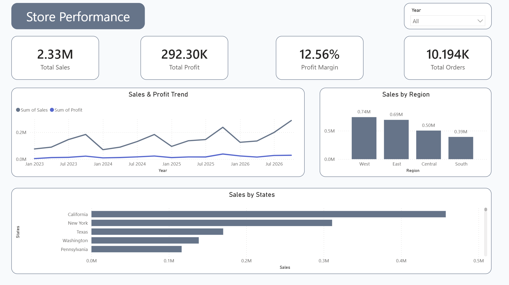

# Giorgi Mshvidobadze — Data Analyst Portfolio

Welcome to my data analytics portfolio. I'm building practical projects that demonstrate my skills in Excel, SQL, Power BI, and business-focused data analysis.

## Skills

- Microsoft Excel (Pivot Tables, XLOOKUP, Charts, Dashboards)
- SQL (PostgreSQL, JOINs, CTEs, CASE Statements, Aggregate Functions)
- Power BI (Interactive Dashboards, DAX, Data Modeling)
- Data Cleaning & Business Analysis
- Python (Currently Learning)
- Pandas for Data Analysis (Currently Learning)

## Projects

| Project | Tools | Status |
|---------|-------|--------|
| Superstore Sales Analysis | Excel | Completed |
| Sales Performance Dashboard | Power BI | Completed |
| Maven Fuzzy Factory SQL Analysis | PostgreSQL / SQL | Completed |

## About

This repository documents my journey into data analytics through practical projects. Each project focuses on analyzing data, identifying business insights, and presenting results clearly.

I am continuing to develop my skills in Excel, SQL, Power BI, and data analysis through hands-on projects. I am also learning Python as a programming language and Pandas for data analysis.

## SQL Project

### Maven Fuzzy Factory SQL Analysis

SQL analysis of an e-commerce dataset using PostgreSQL, covering website and marketing performance, sales, products, refunds, and customer behavior.

[View SQL Project](./SQL/Maven_Fuzzy_Factory/)

## Power BI Project

### Power BI Dashboard Store Performance Page Preview

